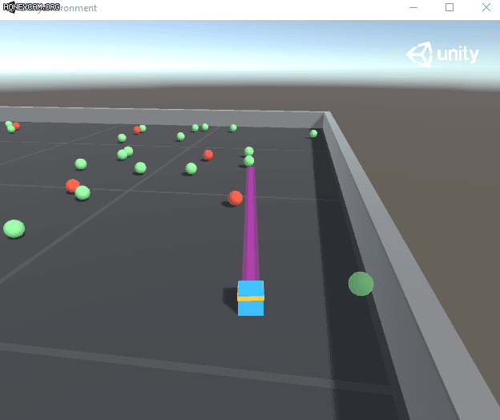
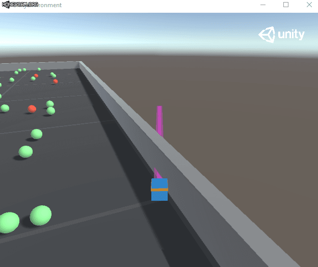
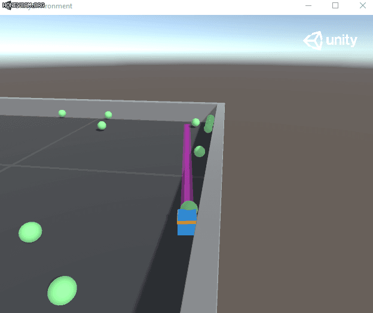
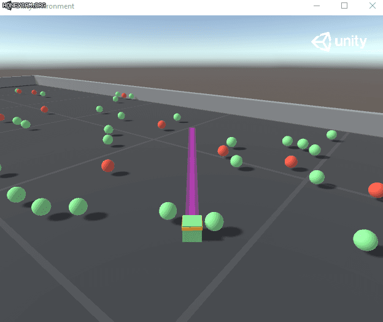

# 여러가지 imitation

이미테이션에는 역시 ml-agents만한게 없어서 mlagents의 food collector로 시도했다.

데이터셋을 어떻게 만들었냐면 사실 아주 잘먹는 데이터셋을 생성하진 않았다. 이 환경은 강화학습이 훨씬 잘하기때문에... 나는 외곽을 좀 잘 도는 액션을 위주로 데이터를 만들었다.

일단 학습된 모델부터 보자.

## catboost

max로 inference를 하였고 그렇기 때문에 안정적인 정답을 고르는 모습을 보인다. 전반적으로 가장 올바른 정답을 고르는 느낌에 가깝다. 

확률로 뽑으면 이렇다. 꽤 내가 만든 데이터셋과 유사하다. max를 사용하는 이유에 대해서도 곰곰히 생각해볼법 한 문제인것 같다.

## BC(pytorch)

BC는 이런 느낌이다. 갈팡질팡 하지만 여러가지 상황을 고려하려는듯한 모습이다. probs를 sample해서 실행했다.

## catboost모델을 JS divergence로 학습(pytorch)

KL로 catboost모델을 학습한 모델이다.

- 전체적으로 보면 BC와 catboost_js가 둘다 적절하긴하다. 느낌상 catboost_js가 좀 더 섬세하게 느껴지는면이 있긴하지만 정확히 구분하기는 좀 어렵다. 내가 데이터를 모을때의 모습과 더 비슷하게 느껴지는건 catboost_js이다.

실험해봐야할것 : KL을 하면 reverse도 줄어드는가?(굳이 JS를 쓸 필요가 없는가?)  
또, reverse를 loss로 써도 forward도 줄어드는가?
-> 그렇다. 하지만 JS를 쓰는게 나을것같다.
사실 처음엔 forward가 곧 CE라고 알고있었고, reverse를 써도 되는가가 궁금했는데... 

# catboost -> KL + 강화학습 : 2021.01.15

단순 imitation이 아닌, 초반엔 KL을 위주로 배우고 나서 강화학습으로 나아가는 모델을 만들어보자. 사실 가장 큰 문제는 env가 쉬워서 그냥 강화학습으로 해도 잘된다는것이다. 여기서는 대략적인 실험만 거치고 바깥의 further_imitation에서 gfootball 환경에 적용해보는 시도를 거쳐보자.

여기엔 여러가지 방법론이 있을 수 있다.

1. SL을 하는가 마는가? (이후 강화학습에서 불러와서 사용하는 용도)
2. RL단에서 prior로 사용할 probs를 어떤 모델을 통해 sample 할것인가?
3. RL 모델에 가끔씩 supervise한다?

크게는 이정도로 나눠볼 수 있을것 같다.  
1번같은 경우는 BC로도 가능하고, catboost를 통해 학습할수도 있을것이다. 아니면 안할수도 있고...  
2번같은 경우는 prob만 있으면 되므로 catboost가 안정적이지 않을까 생각이 든다.  
3번은 RawBeast팀이 반복적으로 학습한다는 느낌으로 언급이 있었어서 한번쯤 생각해볼만한 방법인것 같다.
그렇다면 결론은 1번은 뭐 어떻게든 하고 2번은 catboost를 통해 얻는다 정도로 결론이 나는데

일단 여기에서 마치도록 하고 이후 내용은 further_imitation에서 이어가도록 하자.