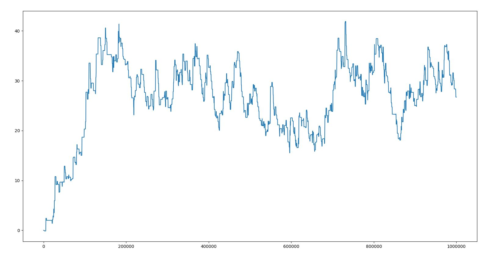
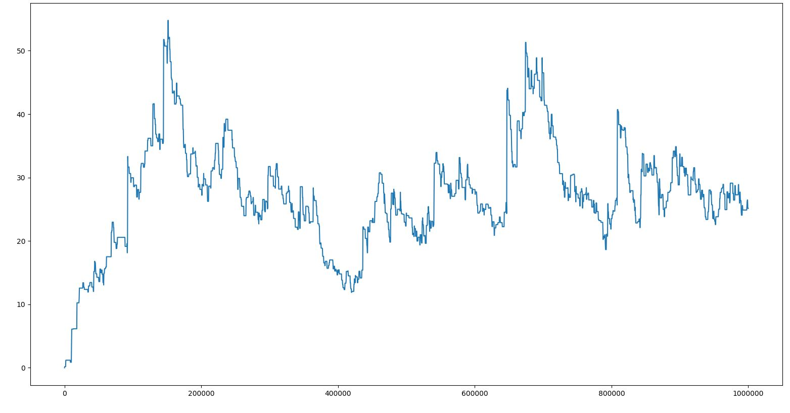

# NLE에 내장된 torchbeast 간단 test

torchbeast는 IMPALA의 구현체라고 한다. 여러 버전이 있는듯하지만 여기서 사용되는건 monobeast인듯 하다.

python -m nle.agent.agent --num_actors 10 --batch_size 32 --unroll_length 10 --learning_rate 0.0001 --entropy_cost 0.0001 --use_lstm --total_steps 1000000  
컴퓨터가 좋지 않아서 실행 옵션은 actor 숫자와 unroll length를 10으로 줄였고 스탭 수도 10억이 아니라 천만으로 줄였다.

[1] 1000만 스탭의 결과_1

[2] 1000만 스탭의 결과_2

그래프는 0.95 0.05 이동평균으로 그렸다.
공식 repo에서 2억스탭까지 100을 넘을까 말까 하는걸 보면 정상적인것같다.

가장 중점적으로 보려고 했던것은 SPS였는데 이 env를 사용하는 가장 중요한 부분이라고 할 수 있기 때문이다. 나의 SPS는 200정도였는데 논문에서 1350으로 나오는걸 보면 굉장히 성능차이가 많이난다. 아무래도 액터 수를 상당히 줄였고, 이번에 wsl을 처음 사용해봤는데 가상머신이기 때문에 느려지는점도 있는것같다.

