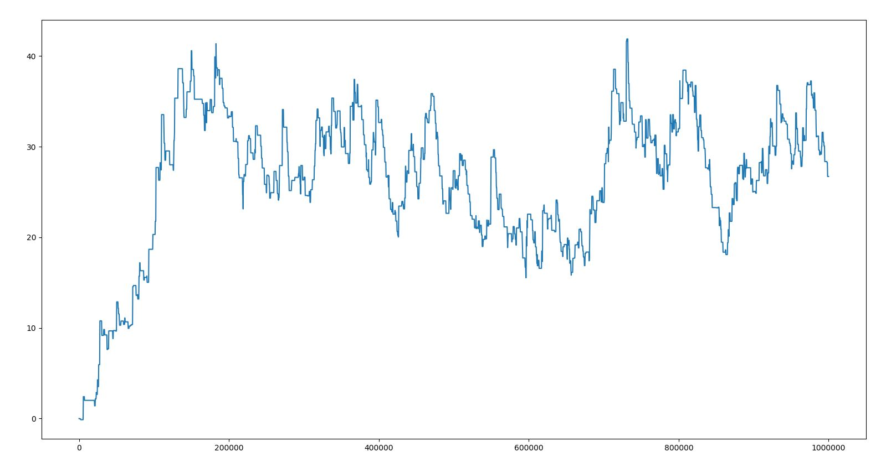
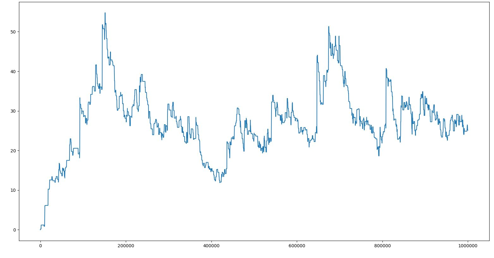

# NLE에 내장된 torchbeast 간단 test

torchbeast는 IMPALA의 구현체라고 한다. 여러 버전이 있는듯하지만 여기서 사용되는건 monobeast인듯 하다.

python -m nle.agent.agent --num_actors 10 --batch_size 32 --unroll_length 10 --learning_rate 0.0001 --entropy_cost 0.0001 --use_lstm --total_steps 1000000  
컴퓨터가 좋지 않아서 실행 옵션은 actor 숫자와 unroll length를 10으로 줄였고 스탭 수도 10억이 아니라 백만으로 줄였다.

[1] 100만 스탭의 결과_1

[2] 100만 스탭의 결과_2

그래프는 0.95 0.05 이동평균으로 그렸다.
공식 repo에서 2억스탭까지 100을 넘을까 말까 하는걸 보면 정상적인것같다.

가장 중점적으로 보려고 했던것은 SPS였는데 이 env를 사용하는 가장 중요한 부분이라고 할 수 있기 때문이다. 나의 SPS는 200정도였는데 논문에서 1350으로 나오는걸 보면 굉장히 성능차이가 많이난다. 아무래도 액터 수를 상당히 줄였고, 이번에 wsl을 처음 사용해봤는데 가상머신이기 때문에 느려지는점도 있는것같다.

라이젠5 2600에 RTX 2060을 사용하는 PC가 GPU를 사용하지 않을때 127, GPU를 사용하면 800정도 나온다. 환경이 간단해서 환경 스탭 진행에 드는 시간보다 연산시간이 길기 때문에 GPU 영향을 많이 받는것같다.

환경에 대해 파악해보면 state는 논문에 나와있는것대로 파악되고(제법 복잡하다), action은 코드에서는 23으로 나오는데 아마 이 코드는 논문의 모델(논문에서는 93)과는 다른것같다. reduced action space를 사용한다고 나온다. 액션을 조합해서 줄인듯. reward는 NetHackScore-v0에서는 넷핵 위키에서의 score를 따르는듯하다. NetHackStaircase-v0에서는 층수에 따라 뭐라고 하는데 내려갈때마다 sparse한 reward가 들어오는듯 하다. 다른 env는 굳이 관심가질 필요는 없는듯하다.