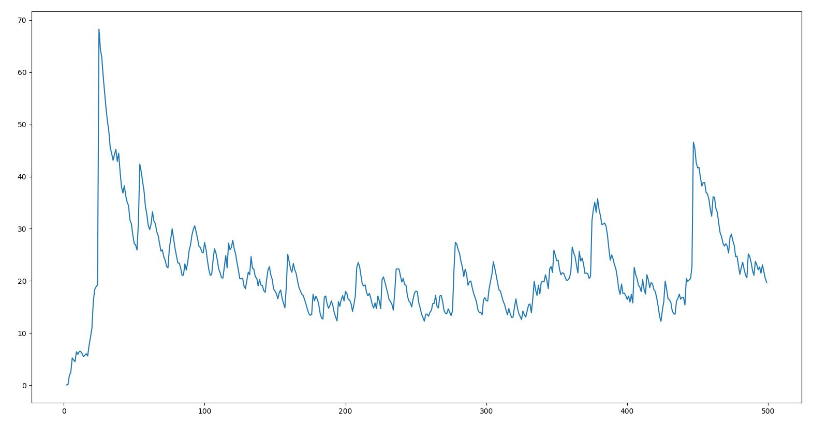
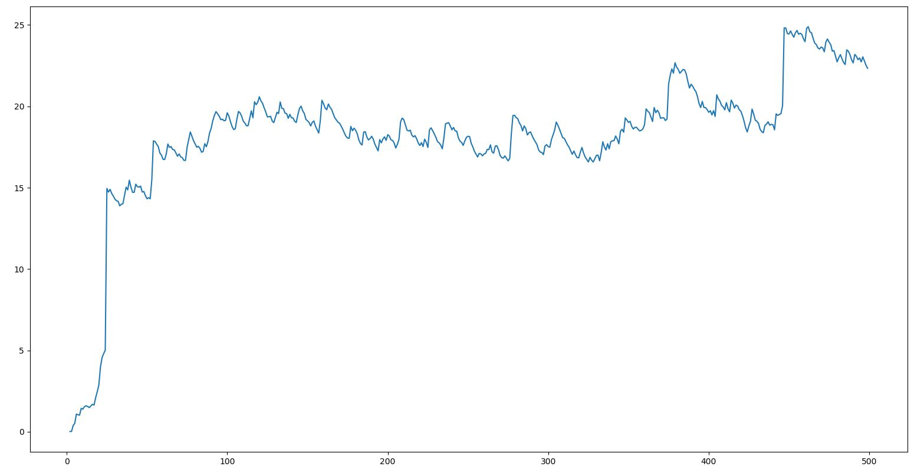
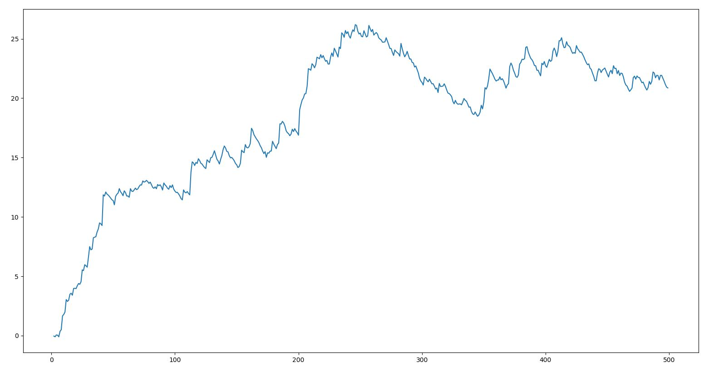

# 2. PPO 구현해서 실험해보기

모델 만들면서 PPO에 blstats만 사용하고 단순히 linear로 아주 간단하게 해봤는데 return이 50정도에 도달할 때도 있었고 생각보다 높게 나왔었다. 물론 좋지는 않았다.

모델은 monobeast baseline과 비슷하게 만들었다. 원래 모델에서 두가지 정보만을 사용하는데, glyphs와 blstats 두개를 사용한다. glyphs는 두가지 방법으로 쓰는데 나는 일단 crop은 하지않고 전체적으로 cnn을 하는 방법만 사용했다. 다른 정보도 더 쓰는것이 좋지 않을까 싶은데 아직은 정확히 모르겠다. 사실 게임에 대한 이해도가 부족해서(오늘 처음 병정개미 만나서 죽어본 뉴비중의 뉴비다) 뭘 적용해야하는지 감도 잘 안온다.

SPS는 CPU만 사용시 50, GPU 사용시 420정도 나온다. 아무래도 멀티프로세스를 사용하는쪽이 더 빠르긴 한것같다. 

중간중간 env에 대해 궁금한점도 해소하면서 가보자. 일단 논문에도 나온 mon-hum-neu-mal, 직업-종족-성향-성별에 대한 궁금함이 있었는데 default는 저 몽크-휴먼-중립-남성이였다. 보통 이런게임에선 기본스탯이 높은것이 초반 성능이 좋다. 논문에서도 이 조합이 가장 score도 높고 staircase도 잘 수행하는것을 보면 기본적으로 꽤나 강한듯하다.

[1] 500episode, 대략 100만스탭정도이고 지수이동평균 0.95/0.05로 그렸다. 초반에 1000 리턴을 받는 에피소드가 있어서 치솟는다.

[2] 이동평균 0.99/0.01로 다시그림

[3] 두번째 테스트

torchbeast랑 비교하면 조금 안좋지만 결국 20점대 후반을 기록하는거 보면 별 차이 없는것같기도 하다. 이쪽이 모델이 좀 더 간단하다는점을 생각하면 거의 차이가 없다고도 볼 수 있을것 같다. 그리고 내쪽은 reward clipping을 하지 않아서 좀 더 큰 리워드에 자주 영향을 받았을거라 생각한다. 특히 음수가 빈번하게 발생하는걸 확인할 수 있었다. torchbeast는 reward clipping [-1, 1]을 default로 사용한다. 위에 1000의 return이 발생하는것같은 경우는 clipping을 하지 않았기 때문인듯 하다.

-27.9 return을 받을때도 있는데, 잘 이해가 가지 않는다. 이 에피소드가 대략 4000스탭이 좀 넘는데 논문에서 나온 패널티는 -0.001만 적혀있어서 계산해보면 -4인데 어떤 다른 minus reward가 존재하는것같다. hp소모라던가 그런게 있나보다. 확인이 필요할듯

