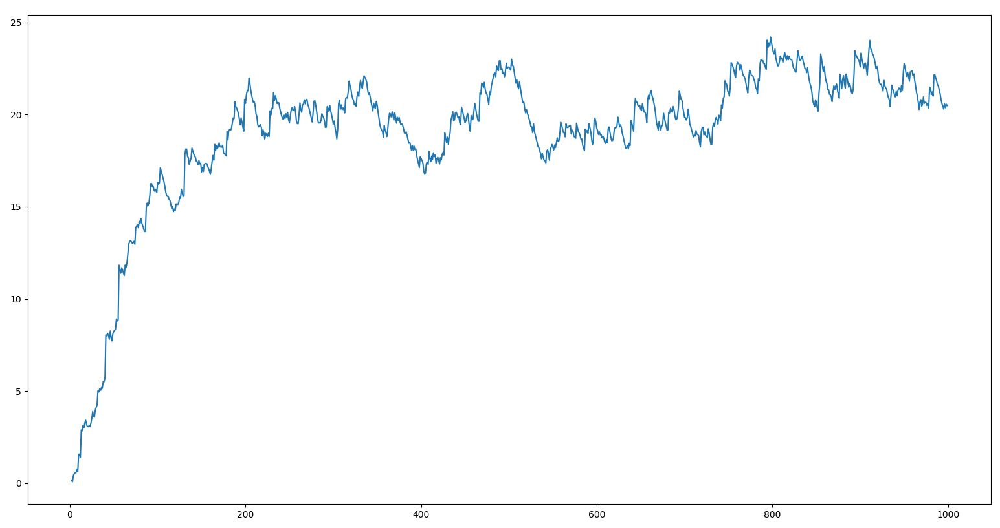
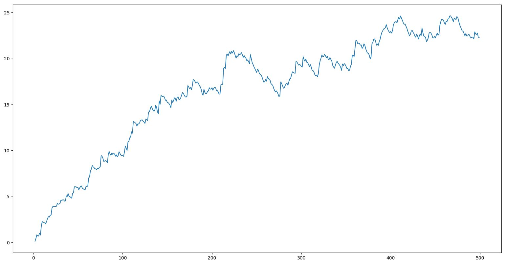

# 3. PPO의 iterate에 대해서

여기선 PPO가 데이터를 샘플링하고 그 데이터를 몇번 쓰는지에 대해 대략적으로 실험해본다.

여러 논문의 결과를 보면 보통은 같은 데이터를 여러번 배우는건 성능 저하의 원인이 된다. 그렇다고 샘플링된 데이터들을 한번쓰고 버리는건 역시 아깝다.

## 1. (2번 학습하기) vs (10번 학습하기)
2번 학습쪽은 1000episode, 10번 학습하는쪽은 500episode. 전체 학습시간은 비슷하다. 500episode가 약간 더 오래걸린다.

[1] 2iter/1000episode, 대략 190만스탭정도이고 지수이동평균 0.99/0.01로 그렸다. 

[2] 10iter/500episode, 대략 90만스탭정도

ppo의 종주국 느낌인 openai는 spinningup의 ppo 구현에서 pi, v 둘다 80번 학습시키도록 구현하고있다. 평소에 '적게 학습시켜도 별로 상관없지않나?' 하는 생각을 오랫동안 해왔는데 보통은 많이 시켜도 경험상 별로 크게 개선되지 않기 때문이였다. 다른 구현들에서는 적게는 2~3번, 많으면 몇십번정도가 일반적인 구현이다. 

직관적으로 생각해보면, 새로운 샘플을 찾아서 조금 학습하고 넘길것인지 / 구한 샘플을 빠르게 여러번 학습할것인지의 선택이라고 볼 수 있는데, 직관적으로 장단점이 느껴지지만 어느게 뚜렷하게 좋다라고 말하기 어려울 것 같다. 물론 컴퓨팅 자원이 풍부하고 데이터를 구하기 수월한 환경이라면 전자를 택하지 않을 이유도 없다고 생각한다. 탐험이 많이 필요한 task일수록(한 쪽으로 치우치지 않는것이 필요한 task인지), 샘플링에 드는 비용이 많을수록, 여러가지 무게추가 각각으로 쏠릴 수 있다. 

NLE를 생각해보자면 샘플링에 비용이 많이 필요하지 않으면서 탐험은 많이 필요하므로 굳이 많이 학습할 필요가 없는듯하다.